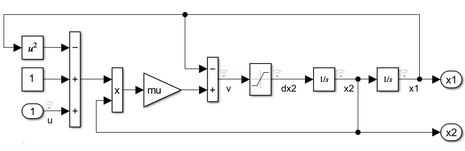
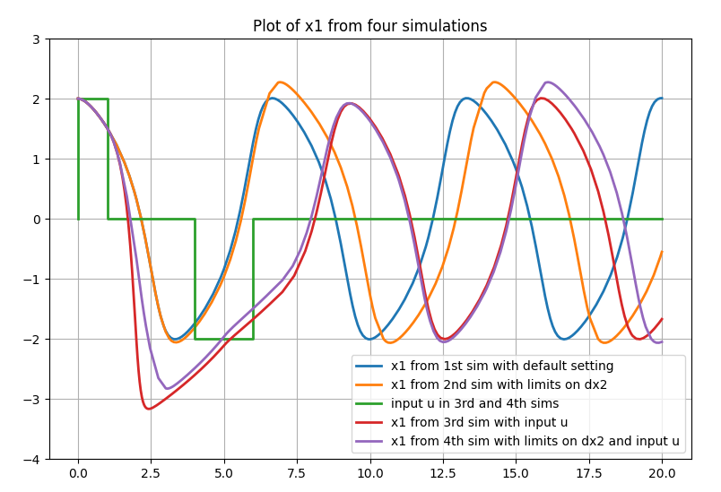
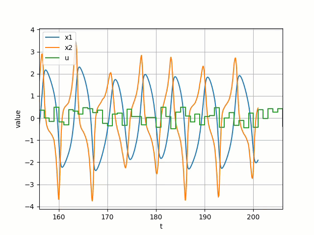

This repo has three examples that show how to simulate a deployed Simulink&reg; model from Python using MATLAB&reg; Runtime. The examples have been tested using R2024b (or later) version of MathWorks&reg; products.

### Design and implementation to ease model parameter and signal access

All the examples use the `model1.slx` included in this repo.



The example model [model1](model1.slx) and the MATLAB function [simulate](simulate.m) illustrate implementation choices that make data marshaling between Python and MATLAB/Simulink relatively straight forward and can be used with any Simulink model. These are:

- Parameterizing the Simulink model using workspace variables makes it easy to simulate with new parameter values passed in from Python.
- Labeling the logged signals in the model with valid identifiers, makes it easy to pack the results into a MATLAB struct and return to Python.
- Extracting the time and data values as numeric vectors from simulation output and returning these to Python makes data marshaling relatively easy.

### Build the python package simulate_*ModelName*

The first step is to package the Simulink model along with the MATLAB function [simulate](simulate.m) into a Python package named simulate_*ModelName* so that it can be simulated in deployment mode. The [MATLAB function](build_python_package_to_run_deployed_model.m) is used to create and install this python package:

`>> build_python_package_to_run_deployed_model('ModelName','model1')`

The above command first builds an installer in the sub-folder `./simulate_model1_installer/<computer>` and asks you if it should go ahead and install it. If you say yes, the python package will be installed in the sub-folder `./simulate_model1/<computer>`. Note that `<computer>` is the name of your system/OS, such as: `pcwin64`, `glnxa64`, etc.

The following products are required to build the python package:

- MATLAB&reg;
- MATLAB Compiler&trade;
- MATLAB Compiler SDK&trade;
- Simulink&reg;
- Simulink Compiler&trade;

### Using simulate_<i>ModelName</i> package with MATLAB Runtime

Once the simulate_<i>ModelName</i> python package installer is built, you can use and share it freely along with the [MATLAB Runtime](https://www.mathworks.com/products/compiler/matlab-runtime.html) without any licensing requirements. Follow these links for instructions to download, [install](https://www.mathworks.com/help/compiler/install-the-matlab-runtime.html) and [configure](https://www.mathworks.com/help/compiler/mcr-path-settings-for-run-time-deployment.html) MATLAB Runtime on your system.

The examples below assume that MATLAB Runtime has been properly installed on your system and the `simulate_model1` python package is installed in the current directory in the `./simulate_model1/<computer>` sub-folder. All examples use the helper function [simulate_model.load_and_init_pkg](simulate_model.py) to locate, import and initialize the `simulate_model1` python package.

### [Basic example that simulates and plots results upon completion](example0_basic.py)

This example shows how to import and use the `simulate_model1` package to run simulations with different parameter and external input signal values, retrieve the simulation results and plot them after each simulation.

`$ python example0_basic.py --mdl model1`



### [Example with output callback to access results during simulation](example1_with_output_callback.py)
This example shows how to use the `simulate_model1` package to simulate `model1` with an output callback function `outputFcn` defined in [Python](example1_with_output_callback.py). `outputFcn` is called periodically during the simulation with latest results. `outputFcn` can also return a boolean value to request simulation stop.

The OutputFcnDecimation argument to [simulate](./simulate.m) can be used to control how often the `outputFcn` is called; increasing this decimation value improves performance because it reduces the callback overhead.

It is important to note here that `outputFcn` is executed in a separate Python process that is started by the MATLAB Runtime simulating `model1`. So `outputFcn` cannot access variables that are initialized in the python process that is running this example.

```
$ python3 example1_with_output_callback.py --mdl model1
    Locating 'simulate_model1' package for model 'model1' ...
    Importing simulate_model1 package from ./simulate_model1/glnxa64/local/lib/python3.11/dist-packages
    Initializing simulate_model1 ...
    Calling simulate ...
    @T =  0.22709525245242995 ; #x1 =  10 ; #x2 =  10
    @T =  1.58678955037287 ; #x1 =  10 ; #x2 =  10
    @T =  2.754467180297537 ; #x1 =  10 ; #x2 =  10
    :
    :
    @T =  99.0 ; #x1 =  10 ; #x2 =  10
    @T =  100.57172049121597 ; #x1 =  10 ; #x2 =  10
    @T =  100.57172049121597 ; Requesting simulation stop
    Press enter to exit ...
    Terminating ...
$
```

### [Example with input callback to specify inputs and plot results during simulation](example2_with_input_callback.py)
This example shows how to use the `simulate_model1` package to simulate `model1` with an input callback function `inputFcn` defined in [Python](example2_with_input_callback.py). `inputFcn` is called during the simulation when new input signal values are needed. `inputFcn` is required to return the input signal value at the simTime specified, however it can also return input signal values at future time points. Returning input values for time points beyond the current simulation time reduces the number of calls to the input function during simulation and improves performance.

It is important to note here that `inputFcn` is executed in a separate Python process that is started by the MATLAB Runtime simulating `model1`. So `inputFcn` cannot access variables that are initialized in the python process that is running this example.

```
$ python example2_with_input_callback.py --mdl model1
    Locating 'simulate_model1' package for model 'model1' ...
    Importing simulate_model1 package from ./simulate_model1/glnxa64/local/lib/python3.11/dist-packages
    Initializing simulate_model1 ...
    Calling simulate ...
    @T =  0.0 : Returning  22  input values
    @T =  22.0 : Received  228  x1 points,  228  x2 points
    @T =  22.0 : Returning  17  input values
    @T =  39.0 : Received  175  x1 points,  175  x2 points
    @T =  39.0 : Returning  18  input values
    :
    :
    @T =  498.0 : Received  215  x1 points,  215  x2 points
    @T =  498.0 : Returning  13  input values
    @T =  511.0 : Received  125  x1 points,  125  x2 points
    @T =  511.0 : Requesting simulation stop
    Press enter to exit ...
    Terminating ...
$
```


